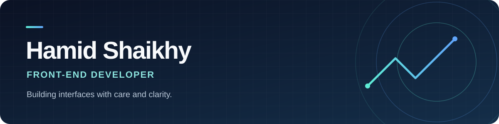

### Front-End Developer · React & TypeScript · Tehran, Iran

I build thoughtful, responsive interfaces for real products — from Persian-first dashboards to visual tools and interactive websites.

## About

I'm Hamid, a front-end developer with production experience building React interfaces, connecting them to APIs, and designing responsive, RTL experiences. At **Dika Asia**, I've worked on digital products ranging from a multilingual company website to an operations and finance dashboard. I enjoy turning complex workflows into clear, usable interfaces.

## Featured work

| Project | What I built | Stack |
| :--- | :--- | :--- |
| **[Flow Studio](https://github.com/hamidshaikhy/flow-studio)** | A Persian, RTL visual workflow builder with connected blocks, branching, step-by-step execution, run history, and JSON/CSV export. Works entirely in the browser. | React · TypeScript · Vite |
| **[Financial Management Panel](https://github.com/hamidshaikhy/financial-management-panel)** | A responsive Persian dashboard with finance and project modules, charts, Jalali dates, Excel export, and light/dark themes. Runs with sample data and no backend. | React · Vite · Recharts |
| **[University Library Management System](https://github.com/hamidshaikhy/university-library-management-system-project)** | A full-stack library app with book search, reservations, loans, admin workflows, and a REST API. | Java · Spring Boot · React · MySQL |
| **[Dika Asia website](https://www.dikaasia.com/)** | A multilingual corporate website with responsive pages, product content, and interactive 3D presentation. | Next.js · React · Tailwind CSS · Three.js |

### More projects

- **[Find Job Remote](https://github.com/hamidshaikhy/Find-Job-Remote)** · JavaScript job-search practice app with filtering and detail views
- **[Login & Signup](https://github.com/hamidshaikhy/login-signup)** · Responsive React authentication interface
- **[Perfume Shop](https://github.com/hamidshaikhy/perfume-shop)** · Store landing page built with HTML, CSS, and JavaScript
- **[Gozineaval](https://gozineaval.com/)** · Responsive educational website built with WordPress

## What I work with

| Area | Tools & skills |
| :--- | :--- |
| **Front end** | React, Next.js, TypeScript, JavaScript, HTML, CSS, Tailwind CSS, Vite |
| **Experience** | Responsive design, RTL interfaces, REST API integration, UI/UX, Three.js |
| **Workflow** | Git, GitHub, Figma, WordPress |

<strong>Background</strong>

My academic background is in Computer Engineering at Islamic Azad University, Tabriz. My work at Dika Asia has involved reusable React components, coordination with backend developers, API integration, and shipping responsive interfaces. I also enjoy learning beyond front-end work; the library management system is one example.

---

**Have a project in mind?** [Send me an email](mailto:hamidshaikhy1382@gmail.com) · [Connect on LinkedIn](https://linkedin.com/in/hamid-shaikhy)

