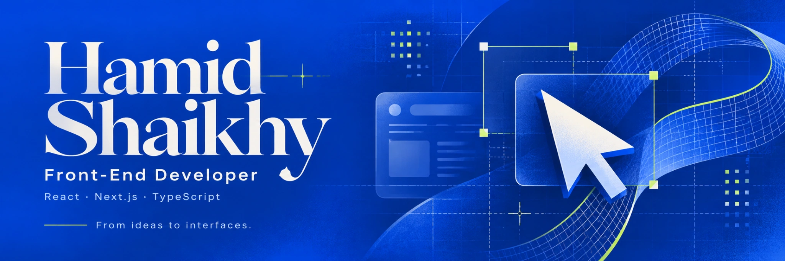

 
 

**Design-minded development. Thoughtful interfaces. Real products.**

Based in Tehran, Iran · React · Next.js · TypeScript

  
  
  

## A little about me

I'm **Hamid Shaikhy**, a front-end developer who enjoys turning complex interactions into clear, usable interfaces. I work with **React, Next.js and TypeScript**, with a particular interest in visual tools, responsive layouts and Persian-first experiences.

At **Dika Asia**, I've developed interfaces for a multilingual corporate website and an internal finance and operations panel, collaborating with backend developers to connect the UI to Django APIs.

My projects explore both sides of front-end work: **how an interface feels** and **how it behaves** — from window management and document pagination to workflow execution and recovery.

## Selected work

<table>
<tr>
<td width="50%" valign="top">
  <h3>01 · Flow Studio</h3>
  
<strong>A visual workflow builder with its own execution engine.</strong>

  
Connected nodes, conditional branches and graph validation. Step-by-step execution, pause/resume, cancellation and interrupted-run recovery, with local persistence and unit/browser tests.

  
<strong>React · TypeScript · React Flow · Zustand · IndexedDB · Vitest · Playwright</strong>

  
<a href="https://github.com/hamidshaikhy/flow-studio">Explore the code →</a>

</td>
<td width="50%" valign="top">
  <h3>02 · Barg — Resume Builder</h3>
  
<strong>A Persian-first resume builder with live A4 previews.</strong>

  
Ten customizable templates, measured pagination, Persian/English layouts and drag-and-drop sections. Browser-print and image PDF export, editable Word export and automatic local saving.

  
<strong>React · TypeScript · Tailwind CSS · Zustand · dnd-kit · jsPDF · docx</strong>

  
<a href="https://github.com/hamidshaikhy/barg-resume-builder">Explore the code →</a>

</td>
</tr>
<tr>
<td width="50%" valign="top">
  <h3>03 · MacFolio</h3>
  
<strong>An interactive portfolio inspired by macOS and iOS.</strong>

  
Draggable, resizable windows and interactive apps sharing a virtual filesystem. PDF viewing, search, themes, persistent preferences and a dedicated touch-oriented mobile interface.

  
<strong>React · TypeScript · Zustand · CodeMirror · PDF.js · Vite</strong>

  
<a href="https://macfolio-delta-one.vercel.app/">Live experience →</a> &nbsp;·&nbsp; <a href="https://github.com/hamidshaikhy/macfolio">Code →</a>

</td>
<td width="50%" valign="top">
  <h3>04 · Dika Asia</h3>
  
<strong>A live corporate website built for a real business.</strong>

  
Persian and Kurdish Sorani pages for products, projects, articles and galleries. Responsive RTL layouts, interactive Three.js presentation and API integration with a Django backend.

  
<strong>Next.js · React · Tailwind CSS · Three.js · REST APIs</strong>

  
<a href="https://dikaasia.com/">Live website →</a>

</td>
</tr>
</table>

## What I work with

| Focus | Tools & practices |
| :--- | :--- |
| **Core front end** | React, Next.js, TypeScript, JavaScript, HTML, CSS |
| **UI & interaction** | Tailwind CSS, Figma, responsive design, RTL/LTR layouts, Three.js |
| **State & data** | Zustand, REST APIs, Zod, IndexedDB |
| **Testing & delivery** | Vitest, Playwright, Vite, Git, GitHub |

<strong>More work & background</strong>

 

- **[Financial Management Panel](https://github.com/hamidshaikhy/financial-management-panel)** — A standalone Persian dashboard demo with finance and project modules, charts, Jalali dates, Excel export and light/dark themes. Uses sample data.
- **[University Library Management System](https://github.com/hamidshaikhy/university-library-management-system-project)** — A full-stack academic project with book search, reservations, loans and administration, built with Java, Spring Boot, React and MySQL.

My academic background is in Computer Engineering at Islamic Azad University, Tabriz. I enjoy learning through projects that involve real interaction, state and data — and documenting the decisions behind them.

---

**Let's build thoughtful interfaces.**

[Email](mailto:hamidshaikhy1382@gmail.com) · [LinkedIn](https://linkedin.com/in/hamid-shaikhy) · [Interactive portfolio](https://macfolio-delta-one.vercel.app/)

